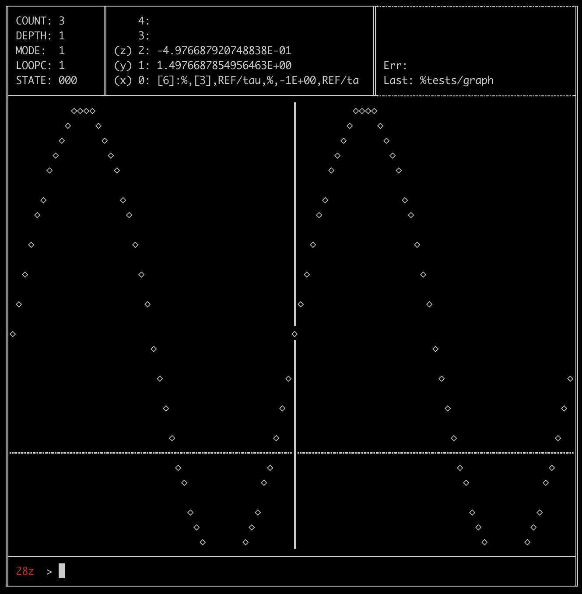

# About
28z is a simple VM loosely inspired by the RPL environment on the HP-28 calculator.

# Building
go build .

# Running
./28z

## Data types

### Floating point
All values are assumed to be floating point by default.

### String
String values are identified by a single preceeding quotation mark (').

### Sequence
Sequence values contain a sequence of instructions created dynamically through the define and reduce sequence instructions.

### Reference
Reference values are identified by a preceeding dollar sign ($) and are replaced with the corresponding register or variable value either when input, or in storing mode when evaluated.

References can also be specified with a preceeding percent sign (%) in interactive input to have the reference be resolved and immediately evaluated.

## Supported instructions

### this
- Description: Refer to the current sequence
- Arg count: 0
- Result count: 1
- Usage: this ⤶

### exchange
- Description: Exchange y and the value in var x
- Arg count: 2
- Result count: 1
- Usage: 3 ⤶ 'a ⤶ exchange ⤶ ⤒a 3⥗a

### pair
- Description: Collect x and y into x
- Arg count: 2
- Result count: 1
- Usage: 1 ⤶ 2 ⤶ collect ⤶ ⤒[2]:1,2

### render
- Description: Render RAM as buffer
- Arg count: 0
- Result count: 0
- Usage: render ⤶

### reduce
- Description: Use x to reduce y to a single value
- Arg count: 2
- Result count: 1
- Usage: reduce ⤶

### ==
- Description: Set the result flag to 1 if x = y
- Arg count: 2
- Result count: 0
- Usage: 

### stream
- Description: Apply x to renderable RAM
- Arg count: 1
- Result count: 0
- Usage: 

### setloop
- Description: Set loop counter to x
- Arg count: 1
- Result count: 0
- Usage: 5 ⤶ setloop ⤶

### stop
- Description: Stop the current loop
- Arg count: 0
- Result count: 0
- Usage: 

### <
- Description: Define sequence
- Arg count: 0
- Result count: 0
- Usage: < ⤶

### expand
- Description: Expand x into the stack
- Arg count: 1
- Result count: -1
- Usage: ⤒[2]:1,2 | expand ⤶ ⤒1 ⤒2

### print
- Description: Print x
- Arg count: 1
- Result count: 0
- Usage: 'Hello world ⤶ print ⤶ Hello world⥱Console

### files
- Description: List availabel files in ROM
- Arg count: 0
- Result count: 0
- Usage: files ⤶ [files]⥱Console

### store
- Description: Store y into x
- Arg count: 2
- Result count: 1
- Usage: 2 ⤶ 'a ⤶ store ⤶ ⤒2; y⥗a

### ceval2
- Description: Conditionally evaluate y if result flag is 1, otherwise evaluate x
- Arg count: 2
- Result count: 0
- Usage: ⤒<sequence>, ⤒<sequence> | ceval2 ⤶

### produce
- Description: Pop from this stack and push to previous
- Arg count: 1
- Result count: 0
- Usage: produce ⤶

### clearbuf
- Description: Clear the output buffer
- Arg count: 0
- Result count: 0
- Usage: 

### -
- Description: Subtract x from y
- Arg count: 2
- Result count: 1
- Usage: 6 ⤶ 2 ⤶ - ⤶ ⤒4

### end
- Description: Return from function
- Arg count: 0
- Result count: 0
- Usage: end ⤶

### generate
- Description: Evaluate a pair where y is the last input and x is the generator
- Arg count: 1
- Result count: 1
- Usage: ⤒<pair> ⤶ generate ⤶ ⤒<pair>, ⤒<result>

### loop
- Description: Execute x if the loop counter is not zero
- Arg count: 0
- Result count: 0
- Usage: 5 ⤶ setloop ⤶ ⤒<sequence> | loop ⤶

### mmap
- Description: Map a file to RAM
- Arg count: 1
- Result count: 0
- Usage: 'rom/file.raw ⤶ mmap ⤶ file.byes⥱RAM

### <=
- Description: Set the result flag to 1 if y <= x
- Arg count: 2
- Result count: 0
- Usage: 

### v+
- Description: Addition for all permuations of x and y
- Arg count: 2
- Result count: 1
- Usage: 

### inverse
- Description: Inverts x
- Arg count: 1
- Result count: 1
- Usage: 

### cos
- Description: cos of x
- Arg count: 1
- Result count: 1
- Usage: 

### purge
- Description: Purge x
- Arg count: 1
- Result count: 0
- Usage: 'a ⤶ purge ⤶ undefined⥗a

### drop
- Description: Drop x
- Arg count: 1
- Result count: 0
- Usage: drop ⤶

### repeat
- Description: Execute x repeatedly
- Arg count: 4
- Result count: 0
- Usage: 0 ⤶ < ⤶'f ⤶ repeat ⤶

### eval
- Description: Evaluate x
- Arg count: 1
- Result count: 0
- Usage: 

### rand
- Description: Generate random between 0 and 1
- Arg count: 0
- Result count: 1
- Usage: 

### consume
- Description: Pop from previous stack and push to current
- Arg count: 0
- Result count: 1
- Usage: consume ⤶

### recall
- Description: Recall x
- Arg count: 1
- Result count: 1
- Usage: 'a ⤶ recall ⤶ ⤒a

### *
- Description: Multiply y by x
- Arg count: 2
- Result count: 1
- Usage: 6 ⤶ 2 ⤶ * ⤶ ⤒12

### zero
- Description: Zero RAM
- Arg count: 0
- Result count: 0
- Usage: 

### dec
- Description: Decrement the loop register
- Arg count: 0
- Result count: 0
- Usage: dec

### sleep
- Description: Sleep for x ms
- Arg count: 1
- Result count: 0
- Usage: 

### apply
- Description: Evalue x against all entries in y to modify y
- Arg count: 2
- Result count: 1
- Usage: apply ⤶

### each
- Description: Evaluate x against all entries in y
- Arg count: 2
- Result count: 0
- Usage: 

### enter
- Description: Enter function
- Arg count: 0
- Result count: 0
- Usage: enter ⤶

### !=
- Description: Set the result flag to 1 if x != y
- Arg count: 2
- Result count: 0
- Usage: 

### unset
- Description: Sets the result flat to 0
- Arg count: 0
- Result count: 0
- Usage: 

### ceval
- Description: Conditionally evaluate x if result flag is 1
- Arg count: 1
- Result count: 0
- Usage: ⤒<sequence> | ceval ⤶

### inspect
- Description: Write a raw object to file
- Arg count: 1
- Result count: 0
- Usage: 

### dup
- Description: Duplicates x on the stack
- Arg count: 1
- Result count: 2
- Usage: 

### graph
- Description: Graph a sequence
- Arg count: 3
- Result count: 0
- Usage: graph ⤶

### halt
- Description: Halt execution
- Arg count: 0
- Result count: 0
- Usage: halt ⤶

### swap
- Description: Swap x and y
- Arg count: 2
- Result count: 2
- Usage: swap ⤶ ⤒x,y

### collect
- Description: Collect stack into x
- Arg count: 1
- Result count: 1
- Usage: 1 ⤶ 2 ⤶ collect ⤶ ⤒[2]:1,2

### >=
- Description: Set the result flag to 1 if y >= x
- Arg count: 2
- Result count: 0
- Usage: 

### status
- Description: Display status
- Arg count: 0
- Result count: 0
- Usage: 

### +
- Description: Add x and y
- Arg count: 2
- Result count: 1
- Usage: 6 ⤶ 2 ⤶ + ⤶ ⤒8

### sin
- Description: sin of x
- Arg count: 1
- Result count: 1
- Usage: 

### put
- Description: Put y into x
- Arg count: 2
- Result count: 0
- Usage: 2 ⤶ 'a ⤶ store ⤶ y⥗a

### show
- Description: Render and pause
- Arg count: 0
- Result count: 0
- Usage: 

### prompt
- Description: Prompt the user for a value
- Arg count: 1
- Result count: 1
- Usage: 'Enter x ⤶ prompt ⤶

### /
- Description: Divide y by x
- Arg count: 2
- Result count: 1
- Usage: 6 ⤶ 2 ⤶ / ⤶ ⤒3

### mod
- Description: y modulus by x
- Arg count: 2
- Result count: 1
- Usage: 6 ⤶ 2 ⤶ / ⤶ ⤒0

### >
- Description: Define sequence
- Arg count: 0
- Result count: 0
- Usage: > ⤶

### clear
- Description: Clear stack
- Arg count: 0
- Result count: 0
- Usage: clear ⤶

