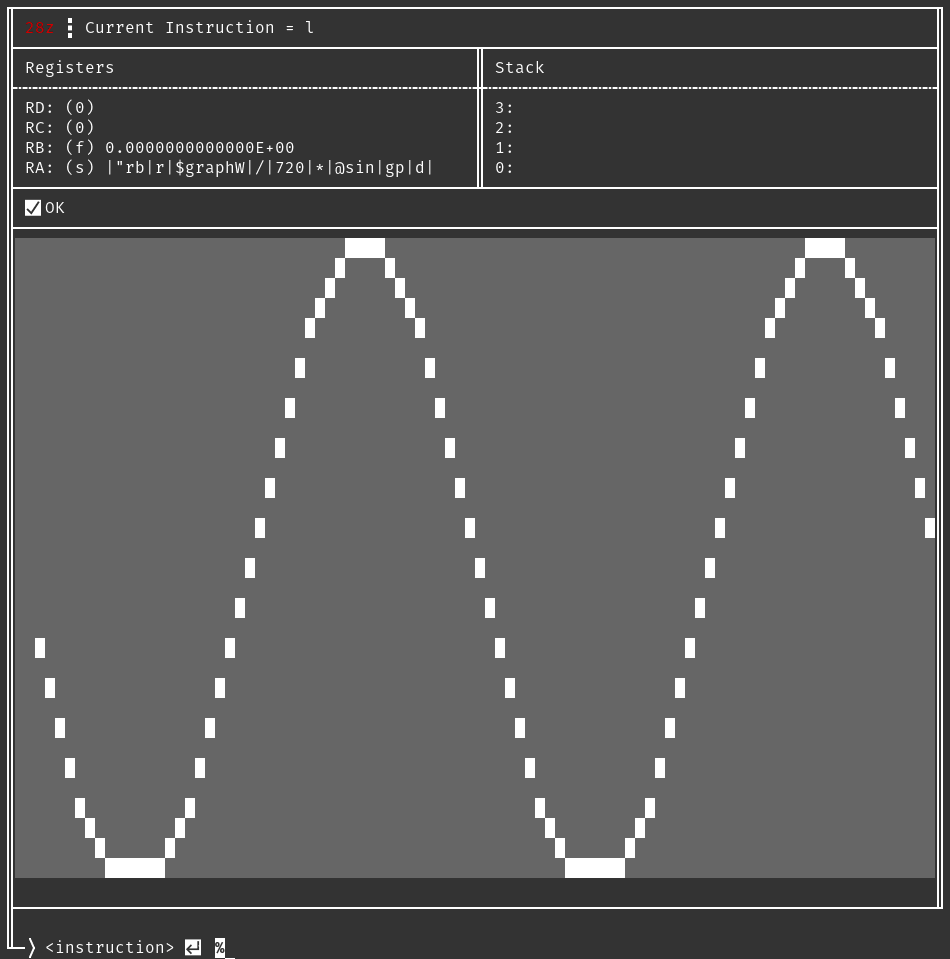

# About
28z is a simple VM loosely inspired by the RPL environment on the HP-28 calculator.

# Build
go build .

# Run
## Run test program
./28z < pythag.28

## Run interactive
./28z

# Usage
All inputs should be separated by a newline (enter).

## Data input
All data is input to the stack which may contain 4 entries.
* Floating point: \<number>
* Hex integer: x\<num>
* Octal integer: o\<num>
* String / program: "\<string>
	* Programs are strings of instructions where each instruction is separated by the | symbol. This symbol should also be used to terminate the string. Programs can be evaluated using the e instruction.

## Basic Operations
All basic operations work in RPN order.
* Operations: {+,-,*,/,^}
	* All of the above operators are bi-functions consuming 0 and 1 from the stack. The result is added back to the stack.
* Integer: i
    * Truncates the floating point value at 0 to an integer. 
* Functions: {@sin,@cos,@tan,@log,@ln,@logb}
	* All of the above are unary functions consuming 0 from the stack. # Build
go build.
* Constants: {\$pi,\$tau,\$e,\$phi}
	* All constants are replaced by their actual value before being added to the stack.
* Evaluate: e
	* This instruction will consume 0 from the stack and execute each instruction from it until it is exhausted.

## Stack Operations
The stack is used to supply arguments to all instructions and functions other than loop. Entries 0 and 1 can also be thought of as x and y.
* Swap 0,1: ;
* Swap [0,1],[2,3]: :
* Drop 0: d

## Registers
All registers may be used for general purpose data store, but some have fixed secondary functions.
* Store: s
	 * 0: The register name to store the value to
	 * 1: The value to store
 * Recall: r
	 * 0: The register name or program name to recall a value from (copy, not move)

## Control logic
Control logic can be used to create more advanced programs.
* Loop: l
	* RA: The statement to evaluate for each loop
	* RB: The number of loops to execute. This will stop when the value is zero and is decremented once for each loop.
* Conditional: ?{=,\<,\>}
	* Applies the specified conditional to 0 and 1 and stores 1 (valid) or 0 (invalid) in RC as a result.
* Conditional prefix: `
	* Any instructions prefixed with this character will only be executed if RC is 1
* Break: break
    * Breaks out of any loop or evaluation.

## ROM
Any programs under the rom directory will be loaded at init and made available to run. The extension is stripped, but any paths under rom/ are preserved.
